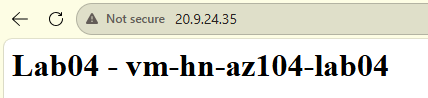
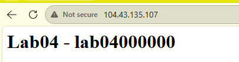
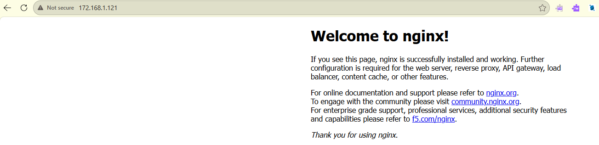
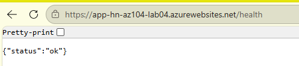

# Lab04 — Test evidence

Tests performed on September 12, 2026, after Bicep reconstruction in the student subscription. Displayed addresses belong to that session and are not live demo endpoints after cleanup.

## Linux VM: custom page

The VM responds through its public IP and displays `vm-hn-az104-lab04`. Nginx and the page were configured through cloud-init.

## Load Balancer: VMSS instance access

An HTTP request to the Load Balancer public IP returns the page from `lab04000000`. This confirms access to one instance, not distribution across multiple instances or failover after a failure. Those tests are reserved for Lab02-B.

## ACI: Nginx page

ACI responds over HTTP. A separate CLI check showed `Running` and image `acrhnlab04.azurecr.io/lab04-web:v1`. The page alone does not establish the private image source; it complements the CLI result and Bicep managed identity configuration with AcrPull.

## App Service: application and environment setting

The ZIP deployment succeeded. The custom Node.js page responded over HTTPS and displayed `training`, the APP_ENV value defined in Bicep.

The original Azure screenshot contains French application text and is retained privately outside this publication folder. The application source was subsequently translated into English and tested locally; it was not redeployed after cleanup. No screenshot has been altered to imply an English Azure deployment.

## App Service: application health endpoint

The `/health` route returns `{"status":"ok"}`. It confirms that the application server responds. It does not check external dependencies or demonstrate configuration of the platform Health Check feature.

## Publication selection

Selected screenshots show no passwords, private SSH keys, or tokens. They contain historical public IPs and the application hostname. Terminal outputs containing account identifiers or keys were excluded.

## Cleanup confirmation

After cleanup, `az group exists` returned `false` for `rg-hn-az104-lab04-compute` in the student subscription. That group no longer exists. This does not inventory other groups or subscriptions.

The original cleanup screenshot is retained outside this publication folder; only its result is recorded here to avoid publishing the subscription ID and local user path.
