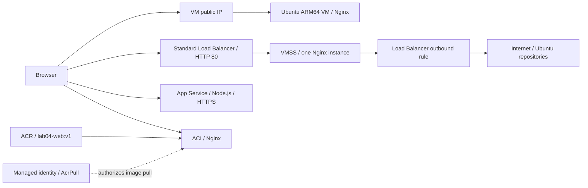

# Lab04 — Azure Compute with Bicep

Hilaire's personal AZ-104 learning path. Reconstruction and Azure tests completed on September 12, 2026; cleanup confirmed. Lab numbering belongs to this personal path, not the official Microsoft lab catalog.

## Objective and results

Deploy a Linux VM, a VM Scale Set behind a Load Balancer, an App Service application, and ACI pulling a private ACR image. Separate infrastructure provisioning, image import, and application publishing.

| Component | Test performed | Result |
|---|---|---|
| Ubuntu ARM64 VM | Nginx page displaying the VM hostname | Passed |
| Single-instance VMSS | Instance page reached through the Load Balancer | Passed |
| ACR → ACI | Private image, Running container, HTTP page | Passed |
| Node.js App Service | ZIP deployment, HTTPS page, APP_ENV=training | Passed |
| Application /health | JSON response `{"status":"ok"}` | Passed |
| Cleanup | `az group exists` returned `false` | Confirmed |

See [test evidence](EVIDENCE.md). Screenshot addresses are historical, not live demo endpoints. The English application text was translated and tested locally after cleanup; the Azure test used the original French text.

## Architecture



The standalone VM has its own public IP and is not in the Load Balancer backend pool. The VMSS uses that pool and the outbound rule. Both share a VNet, subnet, and NSG.

## Repository contents

- `bicep/mainst.bicep`: subscription deployment, resource group creation, and module invocation.
- `bicep/compute.bicep`: group resources, Nginx cloud-init, managed identity, and AcrPull assignment.
- `app/server.js` and `app/package.json`: application without external npm dependencies; routes `/` and `/health`.
- `EVIDENCE.md` and `evidence/`: annotated results.

Bicep files match the deployed version. They do not provision AKS, an additional data disk, or autoscaling rules. AKS was practiced separately in the personal subscription and is not reproduced here.

## Prerequisites

Run these commands in **Windows CMD**, from this folder's root. Azure CLI, Bicep, an SSH public key, and permissions to create resources and role assignments are required. Check regional availability and quotas for the ARM64 VM size.

In `compute.bicep`, adapt `acrName` and `webAppName` to available names and use the same values below. Original names may have been reassigned after deletion. If changing VM size, keep its architecture compatible with the Ubuntu image.

```cmd
az login
set "LAB04_SUBSCRIPTION=REPLACE_WITH_YOUR_SUBSCRIPTION_ID"
set "LAB04_RG=rg-hn-az104-lab04-compute"
set "LAB04_ACR=acrhnlab04"
set "LAB04_WEBAPP=app-hn-az104-lab04"
```

Load an existing SSH **public** key; adjust its path if needed. Never supply the private key. Use `%K` at the CMD prompt and `%%K` inside a `.cmd` file.

```cmd
for /f "usebackq delims=" %K in ("%USERPROFILE%\.ssh\id_rsa.pub") do set "LAB04_SSH_KEY=%K"
az bicep build --file bicep\mainst.bicep
```

## 1. Preview and provision infrastructure

```cmd
az deployment sub what-if --subscription "%LAB04_SUBSCRIPTION%" --location centralus --template-file bicep\mainst.bicep --parameters computeResourceGroupName="%LAB04_RG%" adminSshPublicKey="%LAB04_SSH_KEY%" deployAci=false
```

Review the preview before running the next command, which creates billable resources. Successful compilation and what-if do not guarantee successful provisioning.

```cmd
az deployment sub create --name lab04-initial --subscription "%LAB04_SUBSCRIPTION%" --location centralus --template-file bicep\mainst.bicep --parameters computeResourceGroupName="%LAB04_RG%" adminSshPublicKey="%LAB04_SSH_KEY%" deployAci=false
```

## 2. Import the image and enable ACI

```cmd
az acr import --subscription "%LAB04_SUBSCRIPTION%" --name "%LAB04_ACR%" --source docker.io/library/nginx:latest --image lab04-web:v1
az acr repository show-tags --subscription "%LAB04_SUBSCRIPTION%" --name "%LAB04_ACR%" --repository lab04-web --output table
az deployment sub create --name lab04-initial --subscription "%LAB04_SUBSCRIPTION%" --location centralus --template-file bicep\mainst.bicep --parameters computeResourceGroupName="%LAB04_RG%" adminSshPublicKey="%LAB04_SSH_KEY%" deployAci=true
```

The first deployment creates the identity and registry role assignment. The second allows ACI to pull the imported image. ACR admin credentials remain disabled. New role assignments may need propagation time. `latest` selects the image available at import time; record its digest to pin future reproductions.

## 3. Publish the application

Place `server.js` and `package.json` directly at the ZIP root. The first command invokes PowerShell from CMD to create the archive:

```cmd
powershell -NoProfile -Command "Compress-Archive -LiteralPath 'app\server.js','app\package.json' -DestinationPath 'lab04-appservice.zip' -Force"
az webapp deploy --subscription "%LAB04_SUBSCRIPTION%" --resource-group "%LAB04_RG%" --name "%LAB04_WEBAPP%" --src-path lab04-appservice.zip --type zip
```

The application listens on `process.env.PORT`, provides `npm start`, and requires no external dependencies. It displays only `APP_ENV`, not the full environment.

## 4. Test the services

```cmd
az container show --subscription "%LAB04_SUBSCRIPTION%" --resource-group "%LAB04_RG%" --name aci-hn-lab04-web --query "{State:containers[0].instanceView.currentState.state,Image:containers[0].image,IP:ipAddress.ip}" --output table
az network public-ip list --subscription "%LAB04_SUBSCRIPTION%" --resource-group "%LAB04_RG%" --query "[].{Name:name,IP:ipAddress}" --output table
az webapp show --subscription "%LAB04_SUBSCRIPTION%" --resource-group "%LAB04_RG%" --name "%LAB04_WEBAPP%" --query "{State:state,Hostname:defaultHostName}" --output table
```

Open the VM, Load Balancer, and ACI IP addresses over HTTP. Open App Service over HTTPS, then visit `/health`. Cloud-init may finish after Azure reports successful VM provisioning.

Expected results: VM hostname, VMSS instance hostname through the Load Balancer, Nginx on ACI, and the App Service custom page with `training`. `/health` checks the application response only; it does not check external dependencies or configure platform Health Check.

## Troubleshooting and lessons learned

| Issue | Resolution |
|---|---|
| Resource group resources declared at subscription scope | Separate scopes through a Bicep module. |
| ARM64 VM size paired with an x64 image | Use `Canonical:ubuntu-22_04-lts:server-arm64:latest`. |
| Network references constructed with `resourceId` | Add required VNet and Load Balancer deployment dependencies. |
| Nginx missing from VM and VMSS | Add cloud-init to both OS profiles. |
| Misplaced `outboundRules` and `probes` | Place both arrays under Load Balancer properties; check braces. |
| `NicWithPublicIpCannotReferencePoolWithOutboundRule` | Remove the standalone VM NIC from the pool; keep the VMSS attached. What-if passed, but provisioning detected the incompatibility. |
| ACI identity and dependsOn nested under properties | Move them to resource level; keep imageRegistryCredentials under properties. |
| ACI using a public image directly | Import into ACR, assign AcrPull, and reference the registry login server. |

## Scope and limitations

The VMSS has one instance. Distribution across two servers, stopping Nginx, failed probes, and failover are reserved for Lab02-B, through the portal only, after GitHub publication of Lab04. The F1 plan does not reproduce earlier App Service scaling exercises. This temporary training template uses HTTP for Nginx and allows SSH from any source; restrict SSH to an appropriate administration source when reusing it.

## 5. Clean up

After saving evidence, inspect the dedicated group, then delete it and all its resources:

```cmd
az resource list --subscription "%LAB04_SUBSCRIPTION%" --resource-group "%LAB04_RG%" --query "[].{Name:name,Type:type}" --output table
az group delete --subscription "%LAB04_SUBSCRIPTION%" --name "%LAB04_RG%" --yes
az group exists --subscription "%LAB04_SUBSCRIPTION%" --name "%LAB04_RG%"
set "LAB04_SSH_KEY="
```

Observed result after cleanup on September 12, 2026: `false`. Local sources and evidence were retained.

## References

- [Bicep resource dependencies](https://learn.microsoft.com/en-us/azure/azure-resource-manager/bicep/resource-dependencies)
- [Cloud-init on Azure](https://learn.microsoft.com/en-us/azure/virtual-machines/linux/using-cloud-init)
- [Load Balancer outbound rules](https://learn.microsoft.com/en-us/azure/load-balancer/outbound-rules)
- [ACI image pulls using managed identity](https://learn.microsoft.com/en-us/azure/container-instances/using-azure-container-registry-mi)
- [App Service ZIP deployment](https://learn.microsoft.com/en-us/azure/app-service/deploy-zip)
